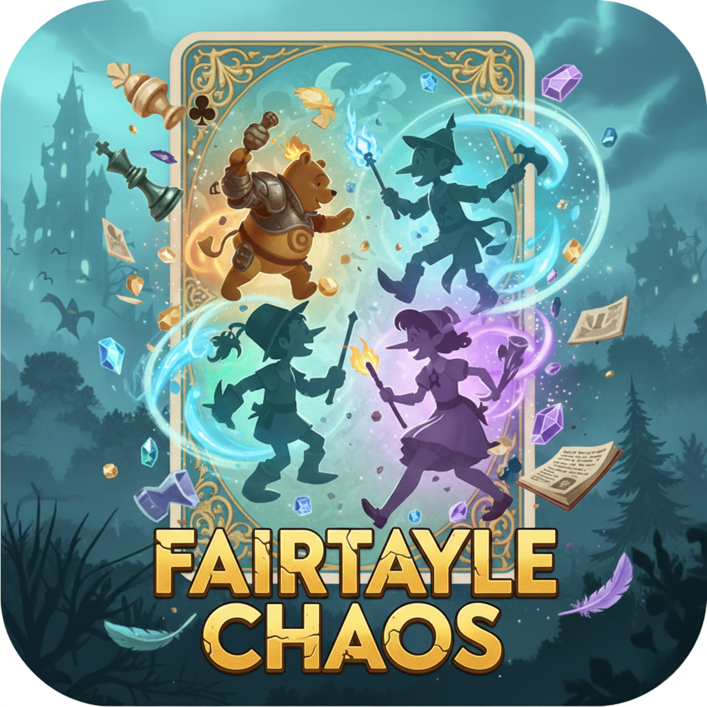
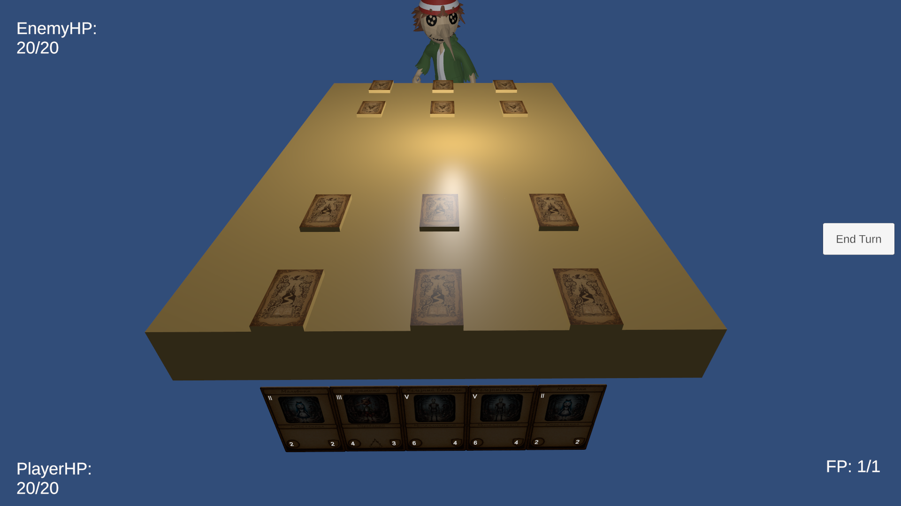
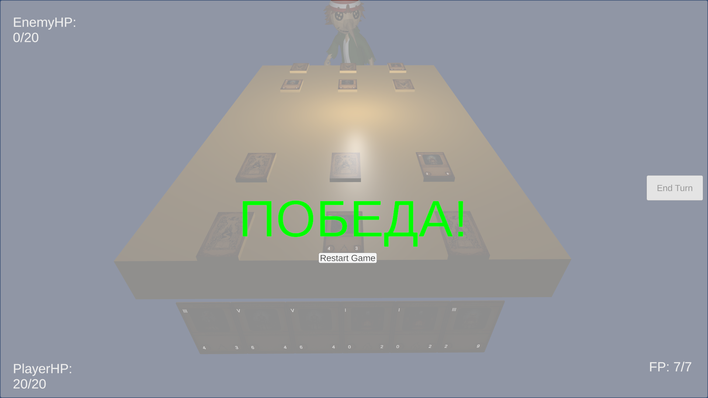

# Fairytale Chaos (Сказочный Хаос)




**Fairytale Chaos** — это цифровая карточная стратегическая игра, разработанная на **Unity**, где игроки призывают на поле боя персонажей, вдохновленных классическими сказками, чтобы сразиться за право выйти из кошмара. Игра использует чистую, модульную архитектуру на основе паттерна **Singleton** для обеспечения масштабируемости и чистоты кода.


### Геймплей


### Ключевые экраны
| Экран | Описание |
| :---: | :--- |
| **Игровое поле** | Поле с местами под карты с UI и кнопка конца хода |
| **Победа/Поражение** | Окончание игры с возможностью заново начать бой с помощью кнопки Restart Game |

---

## Демонстрация Игры (Visuals)



## Как Начать Работу с Проектом

### 1. Требования
* **Unity Hub:** **3.15.2**
* **Unity Editor:** **6000.2.12f1**
* **Система контроля версий:** Git.
* **Среда разработки:** Visual Studio / Visual Studio Code.

### 2. Клонирование и Запуск
1. Клонируйте репозиторий:
   ```bash
   git clone https://github.com/Shhh1ckarno/FairytaleChaos/

### 3. Сборка для Мобильных Платформ
Проект настроен для кросс-платформенной сборки:
* **iOS:** Требуется Mac с Xcode. В Build Settings выберите **iOS** и соберите проект Xcode.
* **Android:** Требуется установленный Android SDK/NDK. В Build Settings выберите **Android** и соберите **APK/AAB** файл.
* **УЖЕ ЕСТЬ СКОМПИЛИРОВАННЫЕ ФАЙЛЫ ДЛЯ АНДРОИД И ПК!!!**
* Папка **FairytaleChaosPC** для пк версии
* Папка **FairytaleChaos(Android version)** для андроид версии

---

## Архитектура и Структура Кода

Проект основан на **компонентно-ориентированном подходе** Unity и паттерне **Singleton** для централизации управления.

### Основные Менеджеры
Каждый менеджер отвечает за один аспект игры, обеспечивая слабую связанность (Low Coupling).

| Менеджер | Роль | Примеры методов |
| :--- | :--- | :--- |
| **`GameManager`** | **Координатор.** Запускает и перезапускает игру, следит за общей инициализацией. | `InitializeGame()`, `RestartGame()` |
| **`BattleManager`** | **Ядро геймплея.** Управляет фазами хода, полем, ресурсами (Очки Страха) и боевыми действиями. | `StartTurn()`, `EndTurn()`, `PlayCard()` |
| **`CardManager`** | **Колода.** Хранит мастер-данные (`CardData`), собирает и перемешивает колоду. | `ResetDeckAndShuffle()`, `DrawTop()` |
| **`HandManager`** | **Рука.** Управляет картами, находящимися в руке игрока, их визуализацией и размещением. | `DrawStartingHand()`, `ClearAllCards()` |
| **`HealthManager`** | **Жизненные показатели.** Отслеживает HP игроков, обрабатывает урон и определяет условия конца игры. | `TakeDamage()`, `EndGame()` |

### Структура Папок
* `Assets/Scenes/`: Игровые сцены.
* `Assets/Scripts/Managers/`: Все основные Singleton-скрипты.
* `Assets/Scripts/Cards/`: Логика карт (`CardController`) и данных (`CardData`).
* `Assets/Prefabs/`: Префабы карт, UI-элементов и игровых объектов.
* `Assets/Art/`: Графические ресурсы (Спрайты, Иконки).

---

## Ключевые Особенности и Технические Решения

### 1. Чистый механизм Рестарта
Проект использует **"мягкий" рестарт** (`GameManager.RestartGame()`), который позволяет полностью сбросить состояние игры без дорогостоящей перезагрузки сцены.

* **Этапы рестарта:** **Очистка** (уничтожение старых карт), **Сброс** (`HealthManager.InitializeHealth()`, `CardManager.ResetDeckAndShuffle()`), **Перезапуск** (`BattleManager.StartGame()`).

### 2. Разделение данных и состояния
* **`CardData` (ScriptableObject):** Используется только для хранения **неизменяемых** характеристик (Attack, MaxHP, Cost).
* **`CardController` (MonoBehaviour):** Хранит **изменяемое состояние** (текущее HP, модификаторы, статус).

### 3. Устранение дублирования логики
Логика добора стартовой руки и инициализации боя **централизована** в **`BattleManager`**, что исключает проблемы с многократным запуском, как это было на ранних этапах разработки.

---


**© 2025 Shhhlyahta**
